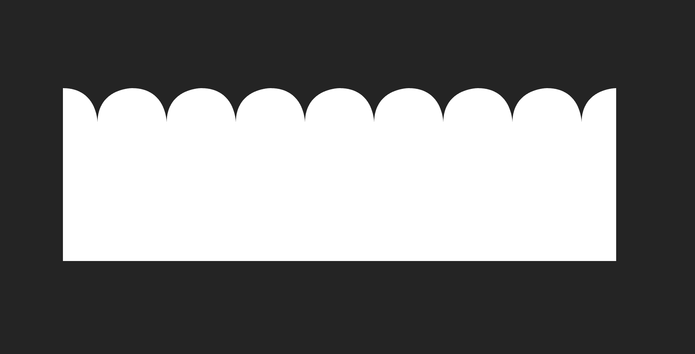
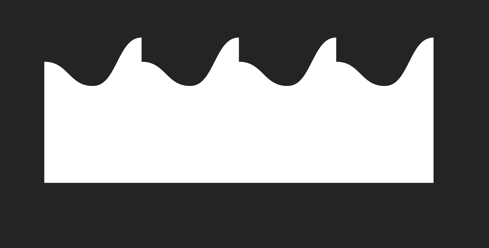

<br>
<br>
<p align="center" style="margin-bottom: 0px">

</p>

<h1 align="center" style="border: 0px">Vue-Surf</h1>

<p align="center">
Very customized animated svg wave Vue component
</p>

<p align="center">
  <a href="https://www.npmjs.com/package/vue-surf"></a>
  <a href="https://github.com/f820602h/vue-surf/blob/master/LICENSE"></a>
</p>

<p align="center">
  <a href="https://f820602h.github.io/vue-surf/">Demo</a>
</p>

<br>

<p align="center" style="margin-bottom: 0px">

</p>

<br>

## Why ?
Current solutions for adding cool waves to websites are often less controllable. Many SVG Wave Generators generate random shapes, if you want to add animation, the randomness factor increases even more.

And the output is usually just image files. If you want to make changes later on, you'll need to regenerate them.

<br>

## Install

```
npm install vue-surf
```

## Usage

Add `<VueSurf>` component from `vue-surf` to your template, and Pass in at least two parameters, `width` and `apexesSeries` to `<VueSurf>`.

```html
<script setup>
import { VueSurf } from "vue-surf";
</script>

<template>
  <VueSurf
    :width="800"
    :apexesSeries="[[0, 50], [100, 0], [100, 50]]"
  />
</template>
```
And Ta-da!


## Props

### width
```typescript
width: {
  type: [Number | String],
  default: "100%"
}
```

The width of the wave, accept direct `number` values representing pixels or `string` with `px` or `%` units."

<br/>

### color
```typescript
type LinearGradientColor = {
  name: string;
  rotate?: number;
  steps: {
    offset: number;
    color: string;
    opacity?: number
  }[];
}

color: {
  type: [String, Object] as PropType<string | LinearGradientColor>,
  default: "white",
}
```
Configuring the fill color of the wave, it accept standard monochrome `string` or utilize a specific object format to configure linear gradients.

```typescript
const color = reactive({
  name: "myGradient" // name must be specified
  rotate: 90,
  steps: [
    { offset: 0, color: '#FEAC5E', opacity: 0.3 },
    { offset: 0.5, color: '#C779D0' },
    { offset: 1, color: '#4BC0C8' },
  ],
})
```


> Radial gradients are currently not supported

<br/>

### shape
```typescript
type WaveShape = "wavy" | "serrated" | "petal";

shape: {
  type: String as () => WaveShape,
  default: "wavy",
}
```
In addition to the regular wave pattern, VueSurf also offer options for a serrated and a petal-like pattern for you to choose from.

<p align="center" float="left">
  
  
</p>

<br/>

### apexesSeries
```typescript
type Apex =
  | [number | string, number | string]
  | {
      distance: number | string;
      height: number | string;
    };

type Apexes =
  | Apex[]
  | {
      apexes: Apex[];
      shape?: WaveShape;
      color?: string | LinearGradientColor;
    };

apexesSeries: {
  type: Array as () => Apexes[],
  default: undefined,
}
```
#### What is Apex?

An apex is configured as the smallest unit of a wave, consisting of both `distance` and `height`. You can represent it using either an object or an array.

```typescript
const apex = ref<Apex>([0, "50%"]); // [distance, height]
// or 
const apex = ref<Apex>({ distance: 0, height: "50%" });
```

Here, the term `distance` refers to the length of separation from the **previous apex**. And `height` denotes the vertical distance of the apex from the reference plane used for calculation.

Both `distance` and `height` accept direct `number` values representing pixels or `string` with `px` or `%` units.


> ⚠️ It is noteworthy that when configured using percentages, they will be calculated relative to the width of the wave. <br/>

#### What is Apexes?

Apexes are an array composed of multiple `apex`, and you can freely use either object or array formats for each apex within the array.

```typescript
const apexes = ref<Apexes>([
  { distance: 0, height: "50%" },
  [100, 50],
  ["100px", 120]
]);
```

Additionally, if you wish to set apexes with shapes or colors distinct from the `shape` and `color` props, you can describe apexes using objects and specify the 'shape' and 'color' properties.

```typescript
const myApexes = ref<Apexes>({
  apexes: [
    { distance: 0, height: "20%" },
    [100, 50],
    ["100px", 120]
  ],
  shape: "petal",
  color: "lightblue"
});
```

> ⚠️ Due to the absence of a preceding apex for the first apex, any distance configuration for it will be disregarded.

#### Setting ApexesSeries

ApexesSeries is an array composed of one or multiple `apexes`. Similarly, you have the option to utilize either object or array formats for apexes within it."

```typescript
const apexesSeries = ref<Apexes[]>([
  [
    { distance: 0, height: "20%" },
    [120, 0],
    [120, 120]
  ],
  {
    apexes: [
      { distance: 0, height: "10%" },
      [120, 0],
      [120, 60]
    ],
    shape: "petal",
    color: "lightblue"
  }
])
```

When you pass an ApexesSeries with a length greater than 1, the wave transformation animation will automatically activate. However, you can disable it by setting `apexesSeriesTransformAuto` to `false`.

<p align="center">

</p>

Of course, you can also directly replace the values of ApexesSeries dynamically to achieve the transformation effect.

```typescript
const apexesSeries = ref<Apexes[]>([
  [
    [0, 50],
    [100, 0],
    [100, 50]
  ],
])

apexesSeries.value = [
  [0, 100],
  [50, 0],
  [50, 100]
]
```

> ⚠️ Please ensure that each `apexes` within the `apexesSeries` possesses an equal **length** and **total distance** to maintain the effectiveness of the transformation animation."

<br/>

### apexesIndex
```typescript
apexesIndex: {
  type: Number,
  default: undefined,
}
```
You can specify `apexesIndex` to determine which set of `apexes` from `apexesSeries` the wave should display.When it is configured, the transformation animation will be deactivated.


<br/>

### side
```typescript
type WaveSide = "top" | "bottom";

side: {
  type: String as () => WaveSide,
  default: "top",
}
```
The determination of whether the wave faces upwards or downwards also dictates whether the height of the apexes is measured from the top or the bottom.

```html
<template>
  <section />
  <VueSurf
    :width="800"
    :side="'top'"
    :apexes-series="[
      [
        [0, 50],
        [100, 0],
        [100, 50]
      ]
    ]"
  />
</template>

<template>
  <VueSurf
    :width="800"
    :side="'bottom'"
    :apexes-series="[
      [
        [0, 50],
        [100, 0],
        [100, 50]
      ]
    ]"
  />
  <section />
</template>
```

<p align="center" float="left">
  
  
</p>

<br/>

### repeat
```typescript
repeat: {
  type: Boolean,
  default: true,
}
```
The decision to automatically repeat is contingent upon whether the cumulative `distance` set by an `apexes` is insufficient to cover the entire `width` of the wave.

```html
<template>
  <section />
  <VueSurf
    :width="800"
    :apexes-series="[
      [
        [0, 50],
        [100, 0],
        [100, 50]
      ]
    ]"
    :repeat="false"
  />
</template>
```
<p align="center">

</p>

<br/>

### closure
```typescript
closure: {
  type: Boolean,
  default: true,
}
```
To facilitate a natural alignment of repeated waves, the height of the last apex in an `apexes` will automatically align with the height of the first apex. You can set it to `false` to disable this behavior.

```html
<template>
  <section />
  <VueSurf
    :width="800"
    :apexes-series="[
      [
        [0, 50],
        [100, 0],
        [100, 100] // higher then first apex
      ]
    ]" 
    :closure="false"
  />
</template>
```
<p align="center">

</p>

<br/>

### smooth
```typescript
smooth: {
  type: [Boolean, Number],
  default: true,
}
```
At times, when you configure a significant difference in distance between consecutive apexes, the presentation of the wave may not appear as smooth.

To mitigate such outcomes, we perform certain calculations. However, you have the option to set it to `false` to disable this behavior.

Alternatively, you can provide a `number` value between 0 and 1 to adjust the level of smoothness.

```html
<template>
  <section />
  <VueSurf
    :width="800"
    :apexes-series="[
      [ 
        [0, 50],
        [100, 0],
        [50, 100],
        [200, 0],
        [100, 50]
      ]
    ]"
    :smooth="false"
  />
</template>
```
<p align="center" float="left">
  
  
</p>

>⚠️ If the numerical disparities are indeed substantial, the extent of smoothing may still remain limited

<br/>

### marquee
```typescript
marquee: {
  type: Boolean,
  default: true,
}
```
When you use <VueSurf>, the marquee animation effect will automatically activate. You can set it to `false` to deactivate the animation. 

Switch it from `true` to `false`, the animation will completely reset. If you only wish to pause the marquee, please set `marqueeSpeed` to zero.

<p align="center">

</p>

<br/>

### marqueeSpeed
```typescript
marqueeSpeed: {
  type: Number,
  default: 2,
}
```
It accepts a `number` value ranging from -25 to 25 to control the speed of the marquee animation. When the value is greater than 0, the animation moves to the right; when less than 0, it moves to the left.


<br/>

### transitionDuration
```typescript
transitionDuration: {
  type: Number,
  default: 500,
}
```

Regardless of how you modify the current state of the wave ( ApexesSeriesTransform, Changing ApexesIndex or Changing Apex Value Directly... ), there will always be interpolation animations. You can pass a `number` value to adjust the transition duration. The unit is millisecond.

<br/>

### apexesSeriesTransformAuto
```typescript
apexesSeriesTransformAuto: {
  type: Boolean,
  default: true,
}
```
When you pass an ApexesSeries with a length greater than 1, VueSurf will transform the wave in accordance with the order of the ApexesSeries. You can set `apexesSeriesTransformAuto` to `false` to disable it.


<br/>

### apexesSeriesTransformDuration
```typescript
apexesSeriesTransformDuration: {
  type: Number,
  default: undefined,
}
```
This parameter only becomes meaningful when `apexesSeriesTransformAuto` is set to true.

It determines how long it takes to replace the current wave with the next set of Apexes. The unit is millisecond.

To achieve a seamless animation effect, when no value is specified, it defaults to being the same as `transitionDuration`. However, if `transitionDuration` is set to 0, `apexesSeriesTransformDuration` will automatically be set to 500.

<br/>

### onApexesChanged
```typescript
type ApexesChangedCallback = (
  currentApexes: Apex[],
  currentShape: WaveShape,
) => void;

onApexesChanged: {
  type: Function as ApexesChangedCallback,
  default: undefined,
}
```
A callback function that is invoked when there is an update to the apexes.

<br>

## License

[MIT](./LICENSE) License © 2023 [max.lee](https://github.com/f820602)